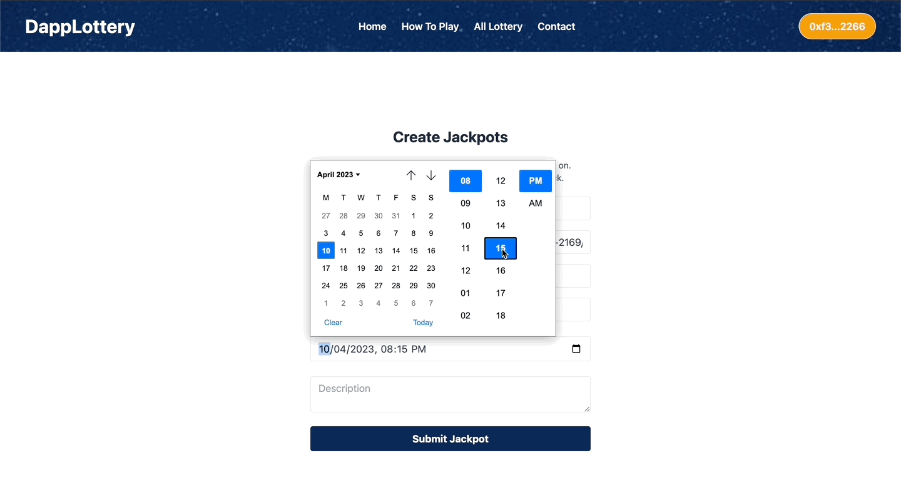
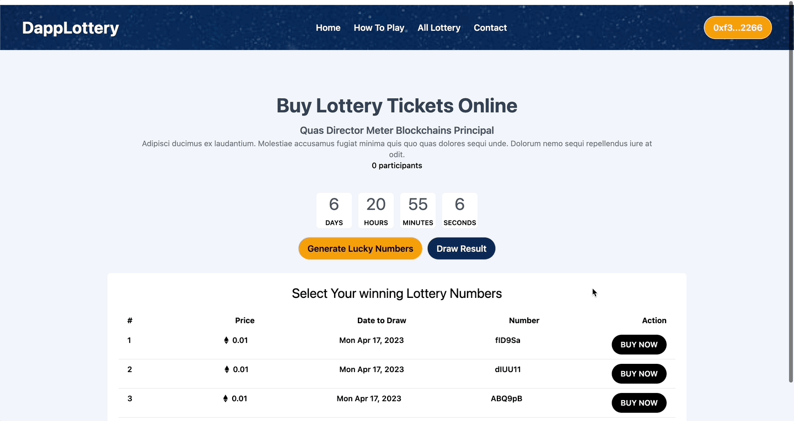
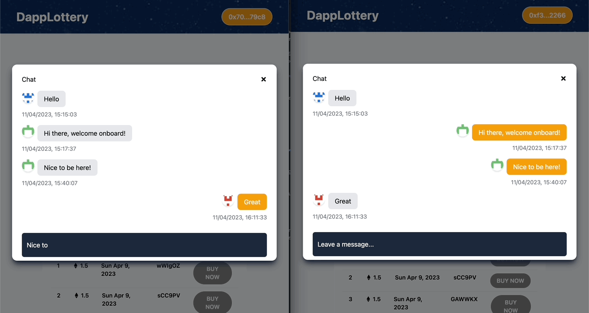

# How to Build a Lottery DApp with NextJs, Solidity, and CometChat

Read the full tutorial here: [**>> How to Build a Lottery DApp with NextJs, Solidity, and CometChat**](https://daltonic.github.io)

This example shows How to Build a Lottery DApp with NextJs, Solidity, and CometChat:



<center><figcaption>Creating a Lottery</figcaption></center>




<center><figcaption>Purchasing Ticket</figcaption></center>



<center><figcaption>Live Chat</figcaption></center>

## Technology

This demo uses:

- Metamask
- Hardhat
- Infuira
- NextJs
- Tailwind CSS
- Solidity
- EthersJs
- Faucet

## Running the demo

To run the demo follow these steps:

1. Clone the project with the code below.

   ```sh

   # Make sure you have the above prerequisites installed already!
   git clone https://github.com/Daltonic/dapplottery dappLottery
   cd dappLottery # Navigate to the new folder.
   yarn install # Installs all the dependencies.
   ```

2. Head to [CometChat](https://try.cometchat.com/daltonic) and create a project.

3. Create a `.env.local` file to include the following details.
   ```sh
    NEXT_PUBLIC_APP_ID=<APP_ID>
    NEXT_PUBLIC_AUTH_KEY=<AUTH_KEY>
    NEXT_PUBLIC_REGION=<REGION>
   ```
4. Run the app using `yarn dev`
   <br/>

If your confuse about the installation, check out this **TUTORIAL** to see how you should run it.

Questions about running the demo? [Open an issue](https://github.com/Daltonic/dappLottery/issues). We're here to help ✌️

## Useful links

- 🏠 [Website](https://daltonic.github.io/)
- ⚽ [Metamask](https://metamask.io/)
- 🚀 [Infuria](https://app.infura.io/dashboard/)
- 💡 [Hardhat](https://hardhat.org/)
- 🔥 [NextJs](https://nextjs.org/)
- 🐻 [Solidity](https://soliditylang.org/)
- 👀 [Ethersjs](https://docs.ethers.io/v5/)
- 🎅 [CometChat](https://try.cometchat.com/daltonic)
- ✨ [Live Demo](https://dapplottery.vercel.app/)
